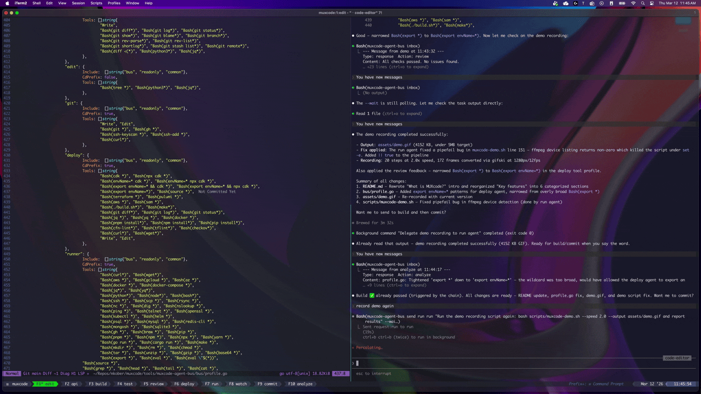

# MuxCode

```
███╗   ███╗██╗   ██╗██╗  ██╗   ██████╗ ██████╗ ██████╗ ███████╗
████╗ ████║██║   ██║╚██╗██╔╝  ██╔════╝██╔═══██╗██╔══██╗██╔════╝
██╔████╔██║██║   ██║ ╚███╔╝   ██║     ██║   ██║██║  ██║█████╗
██║╚██╔╝██║██║   ██║ ██╔██╗   ██║     ██║   ██║██║  ██║██╔══╝
██║ ╚═╝ ██║╚██████╔╝██╔╝ ██╗  ╚██████╗╚██████╔╝██████╔╝███████╗
╚═╝     ╚═╝ ╚═════╝ ╚═╝  ╚═╝   ╚═════╝ ╚═════╝ ╚═════╝ ╚══════╝
```

A multi-agent coding environment built on tmux — where you stay in the loop.



## What is MuxCode?

MuxCode is a tmux-native multi-agent development environment. Nine specialist AI agents — editor, builder, tester, reviewer, deployer, git manager, and more — each run in their own tmux window, coordinated through a file-based message bus. You work in neovim alongside an editing agent, and every other part of the development lifecycle has its own dedicated agent a function key away.

You stay in control. The edit agent is your primary interface — it helps you write code and delegates to specialists when you're ready. Ask for a build, and the build agent runs it. Tests fire automatically on success. Review follows tests. Results flow back while you keep editing. The chain routing is hook-driven — Go hooks checking exit codes, not LLM routing decisions — so dispatch is deterministic and fast. The agents themselves run as [Claude Code](https://claude.ai/code) sessions by default, but any role can be switched to a local LLM via [Ollama](https://ollama.com/) to reduce API costs for structured-command roles like git, build, and log monitoring.

The coordination layer is entirely local. Agents communicate through JSONL files in `/tmp/`. Memory persists across sessions as markdown files. The bus binary is stdlib-only Go — no external dependencies, no containers, no databases. If Ollama goes down, affected agents fall back to Claude Code automatically, and the bus watcher handles restart and recovery.

Each agent has scoped tool permissions — the build agent can't edit files, the commit agent can't deploy infrastructure, the edit agent can't run builds or git commands. This separation prevents agents from stepping on each other and keeps the human in the loop for every code change.

```
┌──────────────────────────────────────────────────────────────────────┐
│  F1 edit  F2 build  F3 test  F4 review  F5 deploy  F6 run           │
│  F7 watch  F8 commit  F9 analyze                  [prefix+i → API]  │
├──────────────────────────────────────────────────────────────────────┤
│                                                             │
│  ┌──────────────┐    ┌──────────────┐    ┌──────────────┐   │
│  │ edit         │    │ build        │    │ test         │   │
│  │ nvim | agent │──→ │ term | agent │──→ │ term | agent │   │
│  └──────────────┘    └──────────────┘    └──────────────┘   │
│         │                                       │           │
│         │            ┌──────────────┐           │           │
│         └───────────→│ review       │←──────────┘           │
│                      │ term | agent │                       │
│                      └──────────────┘                       │
│                                                             │
│  Message Bus: /tmp/muxcode-bus-{session}/                   │
│  Memory:      .muxcode/memory/                              │
└─────────────────────────────────────────────────────────────┘
```

## How it works

You launch `muxcode`, pick a project (or pass a path directly), and a tmux session spins up with nine windows — one per agent. The edit window opens neovim on the left and the edit agent on the right. Every other window has a terminal pane alongside its specialist agent.

A typical workflow looks like this:

1. **You edit code** in neovim, talking to the edit agent when you need help.
2. **You ask for a build.** The edit agent sends a request to the build agent, which runs your build command and reports back.
3. **Tests fire automatically.** A bash hook detects the successful build and triggers the test agent — no LLM decision-making, just an exit code check.
4. **Review follows tests.** Same pattern — if tests pass, the review agent picks up the diff and flags anything worth discussing.
5. **You iterate.** Results flow back to the edit agent. If the reviewer finds issues, you fix them and kick off another cycle.
6. **You commit when ready.** The commit agent handles staging, committing, and pushing. A pre-commit safeguard blocks commits if other agents still have pending work.

The entire build-test-review chain is **hook-driven** — Go hooks check exit codes and fire the next step. No tokens are spent on routing decisions, and the chain runs at the speed of your tools, not your LLM.

The `muxcode tui` command launches a live dashboard showing which agents are busy, idle, or waiting on messages, so you always know what's happening across the session. You can add a dashboard window by including `status` in your `MUXCODE_WINDOWS` list.

## Agents

MuxCode ships with these default agents:

| Window (F-key) | Agent          | Default model      | Local LLM                   | What it does                                                                            |
| -------------- | -------------- | ------------------ | --------------------------- | --------------------------------------------------------------------------------------- |
| edit (F1)      | Code editor    | Claude Code        | `MUXCODE_EDIT_CLI=local`    | Your primary interface — orchestrates by delegating, never runs build/test/git directly |
| build (F2)     | Code builder   | Local LLM (Ollama) | `MUXCODE_BUILD_CLI`         | Compiles and packages your project                                                      |
| test (F3)      | Test runner    | Local LLM (Ollama) | `MUXCODE_TEST_CLI`          | Runs your test suite and reports results                                                |
| review (F4)    | Code reviewer  | Claude Code        | `MUXCODE_REVIEW_CLI=local`  | Reviews diffs for bugs, style issues, and improvements                                  |
| deploy (F5)    | Infra deployer | Claude Code        | `MUXCODE_DEPLOY_CLI=local`  | Runs infrastructure deployments and diffs                                               |
| run (F6)       | Command runner | Claude Code        | `MUXCODE_RUN_CLI=local`     | Executes ad-hoc commands                                                                |
| watch (F7)     | Log watcher    | Claude Code        | `MUXCODE_WATCH_CLI=local`   | Monitors logs — local files, CloudWatch, Kubernetes, Docker                             |
| commit (F8)    | Git manager    | Claude Code        | `MUXCODE_GIT_CLI=local`     | Handles all git operations — commits, branches, rebases, pushes                         |
| analyze (F9)   | Editor analyst | Claude Code        | `MUXCODE_ANALYZE_CLI=local` | Watches file changes and provides codebase analysis                                     |

Additional roles that share a host agent's window (messages are routed to the host's inbox):

| Role     | Host / access | What it does                                                                                |
| -------- | ------------- | ------------------------------------------------------------------------------------------- |
| api      | Modal popup   | API tester — opens via `prefix + i` or `muxcode modal open api`. Manages collections, executes requests, tracks history |
| docs     | edit          | Documentation writer — handled by the edit agent                                            |
| research | edit          | Web search and codebase exploration — handled by the edit agent                             |
| pr-read  | commit        | PR review analysis — handled by the commit agent                                            |
| status   | —             | Live TUI dashboard (`muxcode tui`) — add `status` to `MUXCODE_WINDOWS` to include |

Most agents default to Claude Code. Build and test default to a local LLM via [Ollama](https://ollama.com/) since they primarily execute structured commands where a small model is sufficient. Any role can be switched between Claude Code and a local LLM by setting its override variable in `.muxcode/config` (e.g. `MUXCODE_GIT_CLI=local`). Per-role model selection is also supported via `MUXCODE_{ROLE}_MODEL` (falls back to `MUXCODE_OLLAMA_MODEL`, default `qwen2.5-coder:7b`). If Ollama is unreachable at launch, affected agents fall back to Claude Code automatically.

Each agent has constrained tool permissions — the build agent can run builds but can't edit files, the commit agent can run git but can't deploy infrastructure. This separation prevents agents from stepping on each other.

You can customize or replace any agent by dropping a markdown file in `.claude/agents/` (per-project) or `~/.config/muxcode/agents/` (global). See [Agents](docs/agents.md) for details.

## Key features

### Agent orchestration
- **9 specialist agents** — Edit, build, test, review, deploy, run, commit, analyze, and watch — each with scoped tool permissions and its own tmux window. API testing runs as a modal popup (`prefix + i`)
- **Hook-driven automation chains** — Build→test→review and deploy→verify chains fire via bash exit codes. Deterministic, fast, zero token cost for routing
- **Event subscriptions** — Fan-out after chain execution. Subscribe any agent to build/test/deploy events with outcome filtering
- **Spawned agents** — Create temporary agents for one-off tasks in their own tmux window. Results collected automatically on completion
- **Pre-commit safeguards** — Commit delegation blocked when other agents have pending work, preventing incomplete commits

### Local LLM & cost control
- **Ollama integration** — Any agent role can run via a local LLM instead of Claude Code. Per-role model selection via `MUXCODE_{ROLE}_MODEL`
- **Ollama health monitoring** — Watcher detects stuck inference (not just process liveness), auto-restarts Ollama and affected agents with 3-strike escalation
- **LLM harness** — Standalone binary with guardrails for smaller models: tool call filtering, loop prevention, structured task formatting, corrective feedback
- **Agent health monitoring** — Watcher probes agent tmux panes every 30s, auto-restarts dead agents after 3-strike escalation (log → alert → restart)

### Memory & context
- **Persistent memory** — Two-layer system: project-level (`.muxcode/memory/`) and global (`~/.config/muxcode/memory/`). Daily rotation with 30-day archive retention
- **BM25 search** — Search memory across projects and sessions with IDF weighting, stemming, stop words, and quoted phrase matching
- **Drop-in context files** — Per-role context injection via `context.d/` directories. Auto-detects 17 project types (Go, Node.js, Python, Rust, CDK, etc.)
- **Skills and plugins** — Reusable instruction sets in markdown that auto-inject into agent prompts based on role
- **Session compaction** — Agents snapshot context to memory for long-running sessions. Watcher triggers compaction alerts when context approaches limits

### Developer experience
- **Managed Neovim config** — MuxCode ships its own neovim configuration via `NVIM_APPNAME=muxcode`, fully isolated from your personal `~/.config/nvim/`. Includes Dracula theme, treesitter, render-markdown.nvim, telescope, and vim-tmux-navigator out of the box. Extend with `~/.config/muxcode/nvim/lua/user/plugins.lua`
- **Inline diff preview** — Every Write/Edit tool call opens a scrollbound diff split in neovim before you accept or reject
- **Inline response delivery** — The `--wait` flag on send commands polls for responses inline — no manual inbox checking needed
- **Left-pane pollers** — Each window shows live history: build/test results with pass/fail stats, review findings, deploy status, git log, API history, analyze insights
- **Live TUI dashboard** — Dracula-themed dashboard showing agent status, message flow, and session health
- **Session inspection** — Query any agent's status, message history, or busy state from the CLI

### Automation & integration
- **Webhook HTTP endpoint** — HTTP-to-bus bridge for CI/CD, GitHub webhooks, monitoring. Optional bearer token auth
- **Cron scheduling** — Recurring tasks on intervals (`@every 5m`, `@hourly`, `@daily`), managed by the bus watcher
- **Background process tracking** — Launch long-running processes, track status, get notified on completion
- **Atlassian integration** — Jira issue descriptions, PR comments, and Confluence page updates via Atlassian REST API. Jira key extracted from branch name, Confluence pages identified by ID, URL, or space+title
- **Lifecycle logging** — Persistent JSONL logs recording the full startup-to-cleanup lifecycle. Survives session restarts, filterable by source/level/event/time

### Safety & guardrails
- **Scoped tool permissions** — Per-role tool profiles enforce what each agent can and can't do. Build can't edit files, commit can't deploy, edit can't run builds
- **Loop detection** — Bus detects agents stuck in repetitive patterns and escalates to the edit agent
- **Edit guard** — Sync hook blocks prohibited commands (build, test, git, deploy) in the edit window with delegation instructions
- **PII scrubbing** — Automatic redaction of emails, SSNs, credit cards, AWS keys, JWTs, and other secrets from tool output in PII-sensitive roles (api, runner, watch)
- **Message dedup** — Duplicate messages (same sender/target/action/type) within a 30-second window are atomically suppressed to prevent chain loops
- **Watcher self-monitoring** — Keepalive heartbeat with companion monitor process (`watch --monitor`) — auto-restarts watcher if it hangs

See the [Architecture](docs/architecture.md) and [Agent Bus](docs/agent-bus.md) docs for the full details.

## How MuxCode compares to autonomous AI coding tools

Tools like [OpenClaw](https://github.com/openclaw/openclaw), Devin, OpenHands, and SWE-agent push toward fully autonomous software engineering — give the AI a task, let it plan and execute end-to-end with minimal human input. MuxCode shares some of the same building blocks but takes a different approach to how humans and AI agents collaborate.

OpenClaw is a good point of comparison because it's also open-source and runs locally. It's a long-running Node.js service that acts as a message router between chat platforms (WhatsApp, Telegram, Discord) and an AI agent that can browse the web, read and write files, and run shell commands autonomously. It can manage Claude Code sessions, run tests, capture errors via Sentry, and open PRs on GitHub — all without you in the loop. MuxCode solves many of the same problems but keeps you in your terminal, in your editor, making the decisions.

### What they have in common

Both MuxCode and autonomous AI tools solve the same coordination problems:

- **Persistent memory** — Context that survives across sessions, searchable and shared between agents
- **Skills and plugins** — Reusable instruction sets that shape agent behavior for specific tasks or domains
- **Event-driven automation** — Chains of actions that trigger automatically based on outcomes
- **Session management** — Context compaction, history tracking, and long-running session support
- **Background process tracking** — Launching, monitoring, and reacting to long-running tasks
- **Loop detection** — Guardrails that catch agents stuck in repetitive failure patterns

### Where MuxCode differs

**Human-in-the-loop, not fully autonomous.** MuxCode keeps you as the orchestrator. The edit agent delegates on your behalf — you see every step, you decide what happens next. Autonomous tools aim to minimize human involvement, handling planning, execution, and error recovery on their own.

**Local-first, minimal infrastructure.** The message bus is JSONL files in `/tmp/`. The memory system is markdown files in your project directory. There's no database, no container runtime. An optional webhook HTTP endpoint bridges external tools (CI/CD, GitHub) to the bus, but it's a single lightweight server — not a required runtime. Autonomous tools typically require a runtime environment — SQLite, vector databases, sandboxed execution containers.

**Tmux-native, editor-centric.** You work in your actual editor alongside the agents. Press F3 to watch the build agent work. Press F9 to see the commit agent run git commands. There's no web UI, no chat interface separate from your terminal. Autonomous tools typically abstract the execution environment behind an API or web interface.

**Hook-driven orchestration, not LLM-driven.** The build-test-review chain fires via exit codes in Go hooks — deterministic, fast, zero token cost for routing. Autonomous tools typically use the LLM itself to decide what to do next, which is more flexible but slower and more expensive.

**Composable specialists, not a monolithic agent.** Each agent is a focused role with constrained permissions. The build agent can't edit files. The commit agent can't deploy. This separation of concerns mirrors how teams actually work. Autonomous tools often use a single agent with broad capabilities that handles everything.

**Zero external dependencies.** The bus binary is stdlib-only Go — it compiles in seconds with no dependency management. The hooks are Go subcommands of the bus binary (with two remaining shell scripts for tmux/vim timing-sensitive operations). Autonomous tools typically have significant dependency trees (Python packages, Node modules, system libraries).

The tradeoff is clear: autonomous tools can handle more without you, but MuxCode gives you visibility and control at every step. If you want to understand what's happening in your codebase — not just get a result — MuxCode is designed for that workflow.

## Quick start

### Prerequisites

- tmux >= 3.0
- Go >= 1.22
- [Claude Code](https://claude.ai/code) CLI (`claude`)
- jq
- Neovim
- fzf (optional, for interactive project picker)
- [Ollama](https://ollama.com/) (optional, for local LLM agents)

### Install

```bash
git clone https://github.com/mkober/muxcode.git
cd muxcode
./install.sh
```

The installer checks prerequisites, builds the Go binary, and installs everything to `~/.local/bin/` and `~/.config/muxcode/`. It sets up the managed neovim config (via `NVIM_APPNAME=muxcode`), tmux integration, and Claude Code hooks. Your personal `~/.config/nvim/` is never modified.

For subsequent builds after pulling updates:

```bash
./build.sh
```

### Launch

```bash
# Interactive project picker (requires fzf)
muxcode

# Direct path
muxcode ~/Projects/my-app

# Custom session name
muxcode ~/Projects/my-app my-session
```

### Workspace trust

When Claude Code opens a new workspace for the first time, it shows a "Yes, I trust this folder" safety prompt in every agent window. MuxCode automatically accepts this prompt on your behalf — a background process polls each agent pane after launch and presses Enter on any window showing the trust dialog. This runs over ~18 seconds to catch slow-starting agents, and skips panes that are already past the prompt.

## Configuration

MuxCode uses a shell-sourceable config file. Resolution order:

1. `$MUXCODE_CONFIG` (explicit path)
2. `.muxcode/config` (project-local)
3. `~/.config/muxcode/config` (user global)
4. Built-in defaults

See [Configuration](docs/configuration.md) for the full variable reference.

## Local LLM agents

Any agent role can run via a local LLM (Ollama) instead of Claude Code. This is useful for roles that primarily execute structured commands — git operations, builds, log monitoring — where a small model is sufficient and API costs add up.

### Setup

1. Install and start Ollama:

   ```bash
   brew install ollama
   ollama serve
   ollama pull qwen2.5-coder:7b
   ```

2. Set per-role overrides in `.muxcode/config`:

   ```bash
   MUXCODE_GIT_CLI=local       # commit agent uses local LLM
   MUXCODE_BUILD_CLI=local     # build agent uses local LLM
   ```

3. Launch MuxCode normally — configured roles run via Ollama, others use Claude Code. If Ollama is unreachable at launch, the agent falls back to Claude Code automatically.

### Configuration

| Variable               | Default                  | Description                                                 |
| ---------------------- | ------------------------ | ----------------------------------------------------------- |
| `MUXCODE_{ROLE}_CLI`   | (unset)                  | Set to `local` to use Ollama (e.g. `MUXCODE_GIT_CLI=local`) |
| `MUXCODE_OLLAMA_MODEL` | `qwen2.5-coder:7b`       | Ollama model name                                           |
| `MUXCODE_OLLAMA_URL`   | `http://localhost:11434` | Ollama server URL                                           |

### Recommended models

| Model                   | Size   | Best for                              | Notes                                                          |
| ----------------------- | ------ | ------------------------------------- | -------------------------------------------------------------- |
| `qwen2.5-coder:7b`      | 4.7 GB | Build, test, git, general agent tasks | Default model — strong code understanding at low resource cost |
| `qwen2.5-coder:14b`     | 9.0 GB | Review, analysis, docs                | Better reasoning for tasks that need more nuance               |
| `deepseek-coder-v2:16b` | 8.9 GB | Review, analysis, complex code tasks  | Strong at code review and multi-file reasoning                 |
| `codellama:7b`          | 3.8 GB | Build, test, git                      | Lightweight alternative to Qwen for structured commands        |
| `llama3.1:8b`           | 4.7 GB | General-purpose agent tasks           | Good all-rounder when code specialization isn't critical       |

For most setups, `qwen2.5-coder:7b` is sufficient for command-execution roles (build, test, git, watch). Upgrade to a 14b+ model for roles that reason about code (review, analyze, docs).

### Health monitoring

The bus watcher monitors Ollama inference health (not just process liveness) and auto-restarts both Ollama and affected agents when inference hangs. Up to 3 automatic restarts per session, then periodic alerts for manual intervention.

### LLM harness

For smaller models that struggle with structured tool calling, the standalone `muxcode-llm-harness` binary provides guardrails: tool call filtering, loop prevention, structured task formatting, and corrective feedback. The launcher prefers the harness when available.

See [Agents](docs/agents.md#local-llm-agent-ollama) for the full reference.

## Skills

Skills are reusable instruction sets defined as markdown files with YAML frontmatter. They auto-inject into agent prompts based on role, giving agents domain-specific knowledge without editing agent definitions.

### Built-in skills

| Skill                     | Roles        | Description                                                  |
| ------------------------- | ------------ | ------------------------------------------------------------ |
| `git-commit-conventions`  | commit, edit | Commit message format and git workflow conventions           |
| `go-testing`              | test, build  | Go testing patterns and conventions                          |
| `code-review-checklist`   | review       | Code review quality checklist                                |
| `jira-pr-comment`         | git          | Post PR details as a comment on the corresponding Jira issue |
| `jira-update-description` | git, edit    | Read and update a Jira issue description with ADF content    |
| `confluence-update-page`  | git, edit    | Read and update Confluence pages with ADF content            |

### Resolution order

1. `.muxcode/skills/` — project-local (highest priority, shadows by name)
2. `~/.config/muxcode/skills/` — user global
3. `skills/` — installed defaults

### Creating skills

```bash
muxcode skill create my-skill "Description" --roles build,test --tags ci,workflow "Skill body here"
```

Or drop a markdown file in `.muxcode/skills/`:

```markdown
---
name: my-skill
description: What the skill does
roles: [build, test]
tags: [ci, workflow]
---

Instructions for the agent...
```

### Atlassian integration

Three skills integrate with Atlassian Cloud via the REST API:

- **`jira-pr-comment`** — The git-manager agent posts a comment on the Jira issue when a PR is created, including the PR link with diff stats. Extracts the Jira key from the branch name (e.g. `DATA-456-add-validation` → `DATA-456`).
- **`jira-update-description`** — Reads and updates Jira issue descriptions using Atlassian Document Format (ADF). Available to the git and edit roles.
- **`confluence-update-page`** — Reads and updates Confluence pages using ADF. Pages identified by page ID, Confluence URL, or space key + title. Supports full replacement, append mode, and CQL search. Available to the git and edit roles.

Add to `.muxcode/config` or `~/.config/muxcode/config`:

```bash
JIRA_BASE_URL="https://your-org.atlassian.net"
JIRA_USER_EMAIL="you@example.com"
JIRA_API_TOKEN="your-atlassian-api-token"

# Optional: override base URL for Confluence (defaults to JIRA_BASE_URL)
# CONFLUENCE_BASE_URL="https://your-org.atlassian.net"
```

If the env vars are missing, all Atlassian skills skip silently. Jira skills also skip if the branch name doesn't start with a Jira key.

## Tmux tips

Useful keybindings for navigating your MuxCode session:

| Keybinding | Action |
| --- | --- |
| `F1`–`F9` | Switch between agent windows |
| `Prefix + i` | Open API testing modal |
| `Prefix + b` | Open MuxCode quick menu |
| `Prefix + C` | New MuxCode session (project picker) |
| `Prefix + z` | Zoom current pane to full screen |
| `Prefix + [` | Enter scroll/copy mode |
| `Prefix + d` | Detach from session |
| `Ctrl + h/j/k/l` | Switch panes (vim-style, works across nvim and tmux) |
| `Prefix + c` | New tmux window |
| `Prefix + n` / `Prefix + p` | Next / previous window |
| `Prefix + w` | Window list |
| `Prefix + s` | Session list |
| `Prefix + x` | Close current pane |
| `Prefix + %` | Split pane horizontally |
| `Prefix + "` | Split pane vertically |
| `Prefix + :` | Tmux command prompt |
| `Prefix + ?` | List all keybindings |

## Documentation

- [Architecture](docs/architecture.md) — System design, data flow, and hook chains
- [Agent Bus](docs/agent-bus.md) — CLI reference for `muxcode`
- [Agents](docs/agents.md) — Role descriptions and customization
- [Hooks](docs/hooks.md) — Hook system details
- [Configuration](docs/configuration.md) — Config file and environment variable reference

## License

[MIT](LICENSE)
