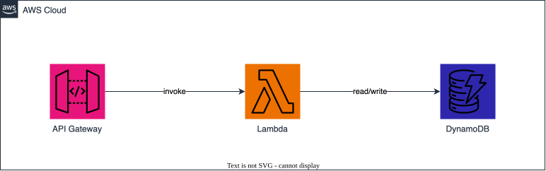

# Plan-agent Diagrams (render → store → embed across req docs, Jira, Confluence)

## Context

The plan agent can already update Confluence pages and Jira issues directly via the
`muxcode atlassian *` CLI (shipped: `Bash(muxcode atlassian *)` in the `plan` tool profile
in `tools/muxcode/bus/profile.go`; the `confluence-update-page` and `jira-manage-issues`
skills are scoped to `plan`; `agents/planner.md` documents the "handle directly" workflow).

This feature adds the second half of the request: let the plan agent **author draw.io-style
architecture diagrams once and place them into any of the three surfaces it maintains —
requirements docs (`docs/`), Jira stories, and Confluence pages**. Confluence is the most
involved embed path; req docs and Jira reuse the same rendered image from `docs/media/`.

### Goal

The plan agent authors diagram **source** (draw.io / mxGraph XML or Mermaid), renders it to
an image (SVG preferred, PNG fallback) into `docs/media/`, and embeds that single rendered
image into whichever surface needs it:

- **Requirements docs** — reference the image with a relative markdown path (native, no upload).
- **Jira stories** — upload the image as an **issue attachment** and reference it via an ADF
  `media` node in the issue description.
- **Confluence pages** — upload the image as a **page attachment** and embed it via ADF
  `mediaSingle`/`media` (the richest, highest-risk path — see Phase 4).

Diagrams are not editable in-place — changing a diagram means re-rendering the source in
`docs/media/` and re-uploading to any surface it was embedded on. This is acceptable.

### Chosen approach (decided — do not re-litigate)

- **Render to image + attach**, not live-editable draw.io embeds.
- Atlassian access for `plan`: Confluence + Jira (already granted).
- **CLI only** for Atlassian — never the Atlassian MCP.
- **No new third-party Go deps** — multipart upload via stdlib `mime/multipart` + `net/http`.
- The renderer (`drawio` / `mmdc`) is an **external, optional** binary — degrade gracefully
  with a clear install hint when absent.
- **First-class-but-optional muxcode dependency**: `install.sh` now checks for both renderers
  and offers to install them via optional prompts (`brew install --cask drawio`,
  `npm install -g @mermaid-js/mermaid-cli`); the feature still degrades gracefully when they are
  declined/absent. `scripts/render-diagram.sh` auto-discovers the draw.io app bundle, so draw.io
  need not be on `PATH` (see §1 / §8).
- **AWS architecture icons are supported natively** via draw.io's built-in `mxgraph.aws4.*`
  stencils (see §1b) — no extra asset downloads. draw.io is the recommended renderer for AWS
  diagrams; Mermaid stays for generic flow/sequence/ER diagrams.

### Related

- Existing Confluence Go: `ConfluenceRead`, `ConfluenceUpdate`, `ConfluenceSearch`,
  `flattenADF` in `tools/muxcode/bus/atlassian.go`.
- Existing CLI: `muxcode atlassian confluence {read,update,search}` in
  `tools/muxcode/cmd/atlassian.go`.
- Existing skill: `skills/MUX-044-confluence-update-page.md` (ADF reference, read+update flow).

## Requirements

### Acceptance criteria

- [ ] `scripts/render-diagram.sh <source> <output>` renders draw.io XML or Mermaid source to
  an image, auto-detecting the available renderer (`drawio` desktop CLI or `mmdc`).
- [ ] Renderer prefers **SVG** output; falls back to **PNG** when SVG is unavailable for the
  detected renderer. Output path is deterministic and PII-safe.
- [ ] draw.io source can use the built-in **AWS architecture icon** stencils (`mxgraph.aws4.*`)
  and they render correctly to SVG/PNG via the `drawio` CLI with no extra asset downloads.
- [ ] The feature handles a **full multi-layer AWS architecture** — account/layer boundary
  containers, DB cylinders, a broad service set (API Gateway, Step Functions, Glue, Athena,
  Lambda, EventBridge, SQS), a nested compute group, labeled flow arrows, a title, and mixed
  **third-party** shapes (non-AWS runtimes / identity providers). Demonstrated by
  `docs/media/sample-aws-architecture.drawio`.
- [ ] The feature handles **complex multi-container architecture diagrams** (non-AWS) — nested
  swimlane/group containers, styled "card" nodes with headers + list items, tabular id-mapping
  nodes, colored + labeled flow arrows, feedback/dashed edges, badges, and a title/subtitle — not
  just trivial shapes. Demonstrated by `docs/media/sample-architecture.mmd`.
- [ ] Diagram **source and rendered output are saved under `docs/media/`** (version-controlled),
  so a diagram authored for a requirements doc, Jira story, or Confluence page has a single
  canonical home in the repo and can be re-rendered or reused across all three surfaces.
- [ ] When no renderer is installed, the script exits non-zero with a clear message and an
  install hint (does not hang or produce a partial file).
- [ ] `muxcode atlassian confluence attach <pageId> <file>` uploads a local file as an
  attachment to the page and prints the attachment filename + id needed for embedding.
- [ ] Re-uploading a file with the same name **updates** the existing attachment rather than
  erroring or creating a duplicate.
- [ ] **Req docs**: a rendered diagram in `docs/media/` can be embedded in a markdown
  requirements doc via a relative image path that renders in the repo/Neovim preview.
- [ ] **Jira stories**: `muxcode atlassian jira attach <issueKey> <file>` uploads the image as
  an issue attachment; the plan agent can then reference it in the issue description (ADF media)
  so it renders inline, without clobbering the existing description.
- [ ] **Confluence pages**: the plan agent can embed an uploaded diagram into a page so it
  renders inline (via the documented embed path), without corrupting existing page content.
- [ ] A skill documents the end-to-end author → render → attach → embed workflow with a worked
  example and the embed snippet.
- [ ] The `plan` tool profile permits the renderer commands; no MCP fallback anywhere.
- [ ] `docs/` note the new capability where relevant (agents.md / configuration.md).
- [ ] Integration test script renders a sample diagram, uploads it, and verifies the embed
  (live or dry-run), documenting what is mocked vs live.

### Technical approach

#### 0. Diagram storage — `docs/media/`

- All diagram **source** (`.drawio`/`.xml`/`.mmd`) and **rendered output** (`.svg`/`.png`) live
  under `docs/media/` so they are version-controlled and shared across every surface a diagram
  can appear on: requirements docs, Jira stories, and Confluence pages.
- Suggested layout — keep source and rendered image side by side with matching basenames:
  ```
  docs/media/
    <slug>.drawio        # or <slug>.mmd — editable source
    <slug>.svg           # rendered output (PNG fallback: <slug>.png)
  ```
  Use a descriptive `<slug>` tied to what the diagram depicts (e.g. `confluence-diagram-flow`),
  not the Jira key or page id, so one diagram can be embedded in a doc, linked from a story, and
  attached to a page without duplication.
- Markdown docs reference the rendered image with a relative path (e.g.
  `` from `docs/requirements/`); Confluence embeds upload the same
  file from `docs/media/` as a page attachment (Phases 3–4).
- `docs/media/` is the deterministic output path the renderer writes to and the upload step
  reads from — no random/tmp paths, keeping source, image, and history together.

#### 1. Renderer — `scripts/render-diagram.sh`

- Bash wrapper, `set -euo pipefail`, 2-space indent, `snake_case` functions.
- Signature: `render-diagram.sh <input-source> <output-image>` (format inferred from output
  extension, default `.svg`).
- Runtime detection order:
  - draw.io desktop CLI: `drawio --export --format <svg|png> --output <out> <in.drawio>`
  - mermaid-cli: `mmdc -i <in.mmd> -o <out.(svg|png)>`
  - Infer source type from input extension (`.drawio`/`.xml` → drawio; `.mmd`/`.mermaid` → mmdc).
- If neither binary is found (or the one matching the source type is missing): print a clear
  error + install hint (`brew install --cask drawio` / `npm install -g @mermaid-js/mermaid-cli`)
  and exit 1.
- **draw.io auto-discovery**: when `drawio` is not on `PATH`, the script probes known install
  locations — the macOS cask app bundle (`/Applications/draw.io.app/Contents/MacOS/draw.io`) and
  common Linux paths (`/opt/drawio/drawio`, `/usr/bin/drawio`, `/usr/local/bin/drawio`). An
  explicit `DRAWIO_BIN` (and `MMDC_BIN`) override is always respected verbatim — which keeps the
  missing-renderer tests deterministic.
- Deterministic output path passed by caller — default output location is `docs/media/`; never
  write to a random/tmp-guessed path.
- No secrets in diagram source or logs (PII-safe).

#### 1b. AWS architecture icons

- draw.io bundles the official **AWS icon stencil libraries** — the current set is
  `mxgraph.aws4.*` (AWS 2017/2019+ icons; legacy `mxgraph.aws3.*` also present). Because the
  `drawio` desktop CLI embeds the full shape library, these icons **export to SVG/PNG natively
  with no extra downloads or asset bundling**.
- **Verified live**: with draw.io installed, `sample-aws.drawio` and `sample-aws-architecture.drawio`
  render to SVG with the `mxgraph.aws4.*` icons fully resolved (real icon geometry, no
  missing-shape placeholders) — confirming no extra assets are needed.
- Authoring pattern in mxGraph XML — reference a service icon via the shape style string, e.g. a
  Lambda resource icon:
  ```xml
  <mxCell vertex="1" style="sketch=0;outlineConnect=0;fontColor=#232F3E;gradientColor=none;
    fillColor=#ED7100;strokeColor=none;verticalLabelPosition=bottom;verticalAlign=top;
    align=center;html=1;fontSize=12;shape=mxgraph.aws4.resourceIcon;
    resIcon=mxgraph.aws4.lambda;" ... />
  ```
  Group/category containers use `shape=mxgraph.aws4.group;grIcon=mxgraph.aws4.group_*` (VPC,
  Region, Account boundaries, etc.).
- The renderer script needs **no AWS-specific logic** — AWS icons are ordinary draw.io shapes, so
  the existing `drawio --export` path handles them. The only requirement is that the `drawio`
  binary (which bundles the stencils) is what renders `.drawio` sources.
- **Recommendation**: use **draw.io for AWS architecture diagrams** — it is the first-class path.
  Mermaid does not ship AWS icons; its `architecture-beta` diagrams support iconify icon packs,
  but wiring an AWS pack through `mmdc` needs extra config and is more limited, so keep Mermaid
  for generic flow/sequence/ER diagrams and reserve AWS-icon work for draw.io.
- A ready AWS-icon sample is committed at `docs/media/sample-aws.drawio` (API Gateway → Lambda →
  DynamoDB inside an AWS Cloud group) — the skill's worked example points at it as a copy-paste
  starting point.
- **AWS capability bar**: real AWS diagrams are multi-service and multi-account —
  `docs/media/sample-aws-architecture.drawio` demonstrates the target: dashed account/layer
  boundary containers, DB cylinders (`mxgraph.aws4.dynamodb`), Step Functions / Glue / Athena / Lambda
  / EventBridge / SQS icons with per-category fill colors, a nested compute group, and labeled
  "Merge Data" flow arrows.
- **Mixed third-party icons**: AWS diagrams routinely include non-AWS elements (a Node/Express
  runtime, an external identity provider, an integration broker). `mxgraph.aws4.*` does not cover
  these — represent them with plain styled boxes (as the sample does) or pull from another draw.io
  shape library; document the chosen approach in the skill. Do not block on a perfect logo.

#### 1c. Diagram complexity — the capability bar

- The feature must handle **rich architecture diagrams**, not just boxes and arrows. The target
  quality bar (from a real reference) is a two-swimlane operational + analytical architecture with:
  nested group containers, colored "card" nodes that carry a header plus a list of sub-items, a
  tabular id-mapping node (IN/OUT rows), thick primary-flow arrows, dashed feedback arrows,
  edge labels (e.g. "CDC Streams"), pill badges on transforms, and an overall title/subtitle.
- Both renderers can express this class: **Mermaid** (`flowchart` + nested `subgraph` swimlanes +
  `classDef` styling + `<br/>` multiline card nodes + labeled/dashed edges) is concise and is what
  the committed `docs/media/sample-architecture.mmd` demonstrates; **draw.io** is the better choice
  when pixel-precise swimlane alignment matters (Mermaid auto-layout is approximate).
- **Open-source genericization rule**: committed `docs/media/` fixtures must use **generic,
  non-internal** content (no real vendor names, internal IDs, or customer architecture) because
  this repo is open source. Real internal/customer diagrams the plan agent authors are embedded
  into **Jira/Confluence** (private) — they are not committed as repo fixtures.

#### 2. Confluence attachment upload — new Go

- Add `ConfluenceUploadAttachment(cfg *AtlassianConfig, pageID, filePath string) (string, error)`
  to `tools/muxcode/bus/atlassian.go`.
- REST: `POST {base}/wiki/rest/api/content/{id}/child/attachment`, `multipart/form-data` with
  `file=@<path>`, header `X-Atlassian-Token: no-check`, basic auth from `AtlassianConfig`
  (reuse the existing auth/`atlassianRequest` pattern — note `atlassianRequest` currently sets
  JSON content-type, so multipart likely needs a small dedicated request builder using stdlib
  `mime/multipart`).
- **Already-exists handling**: Confluence rejects a create when an attachment with the same
  filename exists. Detect this (or check first) and route to the update endpoint
  `POST .../child/attachment/{attachmentId}/data` so re-uploads replace in place.
- Parse the response and return the attachment **filename** and the **fileId / media id**
  (`results[0].extensions.fileId`) — both are needed by the embed step.
- Config guard mirrors existing funcs: fail clearly when `ConfluenceBaseURL`/`UserEmail`/
  `APIToken` are missing.

#### 3. CLI subcommand

- Add `attach` to `atlassianConfluence()` in `tools/muxcode/cmd/atlassian.go`:
  `muxcode atlassian confluence attach <pageId> <file>` → calls `ConfluenceUploadAttachment`,
  prints filename + fileId. Update the `Actions:` usage line (`read, update, search, attach`).

#### 4. Embed the image in the page — **riskiest design decision**

The existing `ConfluenceUpdate` writes the page body as ADF (`atlas_doc_format`). Two embed
options:

- **(a) ADF `mediaSingle` / `media` node (RECOMMENDED — stays in the existing update path).**
  After upload, insert into the page's ADF content array:
  ```json
  { "type": "mediaSingle", "attrs": { "layout": "center" },
    "content": [ { "type": "media", "attrs": {
      "type": "file", "id": "<fileId from upload>", "collection": "contentId-<pageId>" } } ] }
  ```
  Keeps a single representation (`atlas_doc_format`) — no new update path. **Risk**: the media
  node needs a valid `fileId` and the `collection` must be `contentId-<pageId>`; ADF media
  rendering is finicky and must be validated against a live page early (Phase 4 spike).
- **(b) Storage format `<ac:image><ri:attachment ri:filename="diagram.svg"/></ac:image>`
  (FALLBACK).** References purely by filename (no fileId needed), but uses the `storage`
  representation — mixing storage + ADF on one page is lossy, so this would require a **new
  storage-representation update path** in `ConfluenceUpdate` (or a sibling function).

**Recommendation**: implement **(a)** first to reuse the ADF path; if the live spike shows ADF
media does not render reliably, fall back to **(b)** with a dedicated storage-update function.
Whichever path ships, the skill documents the exact working snippet. **Call this out as the
highest-risk item — validate embed rendering on a live scratch page before building on it.**

#### 4b. Embed the image in a requirements doc (lowest effort)

- No new tooling. Once the image is rendered to `docs/media/<slug>.svg`, reference it from any
  markdown doc with a relative path, e.g. from `docs/requirements/drafts/foo.md`:
  ``.
- The managed Neovim config already loads `render-markdown` — confirm SVG/PNG image links
  resolve in preview; if inline image rendering is unavailable in-terminal, the relative link
  is still valid on GitHub and in rendered markdown. Document the exact relative-path depth from
  each requirements subdirectory (`drafts/`, `completed/`, `backlog/`).

**Relative-path depth from each doc location** — `docs/media/` is the render target; a diagram is
referenced by walking up to `docs/` and back down into `media/`:

| Doc location | Path prefix to `docs/media/` | Example embed |
|--------------|------------------------------|---------------|
| `docs/requirements/drafts/<doc>.md` | `../../media/` | `` |
| `docs/requirements/completed/<doc>.md` | `../../media/` | `` |
| `docs/requirements/backlog/<doc>.md` | `../../media/` | `` |
| `docs/requirements/<doc>.md` (backlog list) | `../media/` | `` |
| `docs/<doc>.md` | `media/` | `` |

All three requirements subdirectories (`drafts/`, `completed/`, `backlog/`) sit one level under
`docs/requirements/`, so they share the **same** `../../media/` prefix — moving a spec between
them does not change diagram links.

**Worked example (rendered inline below).** This spec lives in `docs/requirements/backlog/`, so it
embeds the committed `docs/media/sample-aws.svg` (rendered from `sample-aws.drawio` via
`scripts/render-diagram.sh`) with a `../../media/` prefix:

```markdown

```


#### 4c. Embed the image in a Jira story (issue attachment + ADF media)

- Jira issue descriptions are ADF (same format `JiraUpdate` already writes), so the embed is
  analogous to the Confluence ADF path — the difference is the **upload endpoint**.
- Add `JiraUploadAttachment(cfg *AtlassianConfig, issueKey, filePath string) (string, error)`
  to `tools/muxcode/bus/atlassian.go`: `POST {base}/rest/api/3/issue/{issueKey}/attachments`,
  `multipart/form-data` `file=@<path>`, header `X-Atlassian-Token: no-check`, basic auth. Reuse
  the same stdlib multipart request builder written for Confluence in Phase 3 (share a helper).
- Parse the response array; return the attachment **filename** and **id**. Jira re-upload with
  the same filename creates a **new** attachment (Jira does not dedupe by name) — document that
  callers should delete the prior attachment or accept versioned filenames (`<slug>-v2.svg`).
- Reference the uploaded image in the description via an ADF `media` node
  (`{"type":"media","attrs":{"type":"file","id":"<attachmentId>","collection":"..."}}`) inside a
  `mediaSingle`, appended to the existing description content so prior text is preserved. Validate
  the exact `collection`/`id` values against a live issue during the Phase 4 spike (same risk
  class as Confluence media). If ADF media proves unreliable in Jira, the fallback is a plain
  ADF link to the attachment URL rather than an inline render.
- Add `attach` to `atlassianJira()` in `tools/muxcode/cmd/atlassian.go`:
  `muxcode atlassian jira attach <issueKey> <file>` → prints filename + attachment id.

#### 5. Plan tool profile

- Add renderer perms to the `plan` profile `Tools` in `tools/muxcode/bus/profile.go`:
  `Bash(scripts/render-diagram.sh*)`, `Bash(bash scripts/render-diagram.sh*)`,
  `Bash(drawio*)`, `Bash(mmdc*)`. (`Bash(muxcode atlassian *)` already present covers `attach`.)

#### 6. Skill

- Add `skills/MUX-005-plan-diagrams.md` (or extend `skills/MUX-044-confluence-update-page.md`) scoped to
  `[plan, edit]` documenting the author → render → store → embed workflow with a worked example
  for **each of the three surfaces**: (1) req-doc relative markdown link, (2) `jira attach` +
  ADF media in the issue description, (3) `confluence attach` + ADF/storage embed snippet. Cover
  the shared `docs/media/` storage convention and the CLI-only / no-MCP policy.
- Include an **AWS-icon draw.io example** (`mxgraph.aws4.*` shapes) as a copy-paste starting
  point, and note that draw.io — not Mermaid — is the path for AWS architecture diagrams.

#### 7. Docs

- Note the new capability in `docs/agents.md` (plan agent — diagram authoring) and
  `docs/configuration.md` (optional external `drawio`/`mmdc` dependency + install hints).

#### 8. External dependencies (optional)

The feature relies on two **optional** external binaries. Both are checked by `install.sh` (a
"diagram renderers" section after the Ollama check) which offers to install them via optional
prompts; the feature degrades gracefully when they are declined or absent.

| Binary | Purpose | Install | Source types |
|--------|---------|---------|--------------|
| `drawio` (draw.io desktop) | Render draw.io / mxGraph XML (incl. AWS `mxgraph.aws4.*` icons) | `brew install --cask drawio` | `.drawio`, `.xml` |
| `mmdc` (mermaid-cli) | Render Mermaid | `npm install -g @mermaid-js/mermaid-cli` | `.mmd`, `.mermaid` |

- `scripts/render-diagram.sh` auto-discovers the draw.io binary when it is not on `PATH` (macOS
  app bundle + common Linux paths); `DRAWIO_BIN` / `MMDC_BIN` overrides are respected verbatim.
- Cross-reference: `docs/configuration.md` (dependency + install hints) and `docs/agents.md`
  (plan-agent capability) are updated in Phase 5, and `install.sh` is the install entry point.

### Key files

| File | Purpose |
|------|---------|
| `docs/media/` | New — canonical version-controlled home for diagram source + rendered images shared across req docs, Jira stories, and Confluence pages |
| `docs/media/sample-*.{drawio,mmd}` | New — committed, genericized integration-test fixtures: `sample-shapes.{drawio,mmd}` (simple shapes), `sample-aws.drawio` (minimal AWS icons), `sample-architecture.mmd` (complex non-AWS architecture), `sample-aws-architecture.drawio` (complex multi-layer AWS architecture) |
| `scripts/render-diagram.sh` | New — render draw.io/Mermaid source to SVG/PNG under `docs/media/`, detect+auto-discover renderer, degrade gracefully |
| `install.sh` | Updated — "diagram renderers" section checks for `drawio`/`mmdc` and offers optional install (`brew install --cask drawio` / `npm install -g @mermaid-js/mermaid-cli`) |
| `tools/muxcode/bus/atlassian.go` | Add `ConfluenceUploadAttachment()` + `JiraUploadAttachment()` sharing one stdlib multipart helper; Confluence update-existing handling |
| `tools/muxcode/cmd/atlassian.go` | Add `attach` subcommand to `atlassianConfluence()` **and** `atlassianJira()`; update both usage lines |
| `tools/muxcode/bus/profile.go` | Add renderer `Bash(...)` perms to the `plan` profile |
| `skills/MUX-005-plan-diagrams.md` (or extend `skills/MUX-044-confluence-update-page.md`) | Document author→render→store→embed workflow (3 surfaces) + AWS-icon example |
| `docs/agents.md`, `docs/configuration.md` | Note new capability + optional external dependency |
| `scripts/test-plan-diagram-render.sh` | New (Phase 2) — render-only integration test: generates image files from every fixture, no upload/embed; CI-safe (no creds) |
| `scripts/test-plan-diagram.sh` | New (Phase 6) — end-to-end integration test: upload + embed across req doc, Jira, Confluence |

## Implementation

### Phase 1: Renderer wrapper

- [x] Create `docs/media/` as the canonical diagram home, seeded with committed sample fixtures:
  `sample-shapes.drawio` + `sample-shapes.mmd` (circles, rounded boxes, connecting arrows) and
  `sample-aws.drawio` (AWS `mxgraph.aws4.*` icons: API Gateway → Lambda → DynamoDB).
- [x] Create `scripts/render-diagram.sh` with `set -euo pipefail` and usage/help output.
- [x] Detect source type from input extension (`.drawio`/`.xml` vs `.mmd`/`.mermaid`).
- [x] Detect available renderer at runtime (`drawio`, `mmdc`); pick by source type.
- [x] Render to SVG by default; PNG fallback based on output extension; default output dir is
  `docs/media/` with the rendered image basename matching the source basename.
- [x] On missing renderer, exit 1 with clear message + install hint; no partial output file
  (renders to a temp file first, then atomic `mv`).
- [x] Emit the final output path on success for the caller to consume (stdout; logs to stderr).
- [x] Render the committed `docs/media/sample-aws.drawio` sample → confirms the `drawio` CLI
  resolves the AWS `mxgraph.aws4.*` stencils with no extra assets. **Verified live** with draw.io
  installed (icons resolve to real geometry, no placeholders).

### Phase 2: Integration test — render only (no upload/embed)

Validates the Phase 1 renderer end-to-end against every committed fixture. **Generates image
files only — does not attach, upload, or embed anything.** Needs no credentials/network, so it
runs in CI (with a graceful skip of the live-render assertions when `drawio`/`mmdc` are absent;
the renderer-absence and arg-validation paths are always asserted).

- [x] Create `scripts/test-plan-diagram-render.sh` (`set -euo pipefail`).
- [x] Render `docs/media/sample-shapes.drawio` (draw.io) → assert SVG/PNG output exists, non-empty.
- [x] Render `docs/media/sample-shapes.mmd` (Mermaid via `mmdc`) → assert output exists (exercises
  the mermaid path).
- [x] Render `docs/media/sample-aws.drawio` (`mxgraph.aws4.*`) → assert SVG is non-empty with the
  rendered AWS icons (no missing-shape/placeholder fallback — asserted via graphic-primitive count).
- [x] Render `docs/media/sample-architecture.mmd` → assert output exists (complex non-AWS bar).
- [x] Render `docs/media/sample-aws-architecture.drawio` → assert SVG non-empty, multi-service AWS
  icon set resolved (complex AWS bar — primitive-count assertion).
- [x] Assert each rendered file lands under `docs/media/` with a basename matching its source.
- [x] Missing-renderer path → assert non-zero exit + install hint (mock / PATH-shadow); no partial
  output file left behind. (Ran green.)
- [x] Document what is **mocked** (renderer absence, arg validation) vs requires **installed
  renderers** (the live-render assertions), with graceful CI skips.
- [x] Run the script and verify all checks pass with `drawio`/`mmdc` installed. **Full green:
  14 pass / 0 fail / 0 skip** — all 5 fixtures render live (shapes draw.io + Mermaid, AWS icons
  18 primitives, complex non-AWS Mermaid, complex AWS 79 primitives). `mmdc` v11.16.0 installed.

### Phase 3: Attachment upload — Confluence + Jira (Go + CLI)

- [x] Add a shared stdlib `mime/multipart` request helper (basic auth + `X-Atlassian-Token:
  no-check`) reused by both upload functions (`atlassianMultipartUpload` + `atlassianUploadFile`).
- [x] Add `ConfluenceUploadAttachment()` to `bus/atlassian.go`; guard on missing config.
- [x] Handle the Confluence "attachment already exists" case → update via `.../attachment/{id}/data`
  (`confluenceFindAttachmentID` routes create vs update).
- [x] Parse response; return attachment filename + fileId (media id) — handles create (`results[]`)
  and update (single object) response shapes.
- [x] Add `JiraUploadAttachment()` to `bus/atlassian.go` → `POST /rest/api/3/issue/{key}/attachments`;
  parse the response array; return filename + attachment id.
- [x] Add `attach` subcommand for **both** `atlassianConfluence()` and `atlassianJira()` in
  `cmd/atlassian.go`; print filename + id; update both usage lines.
- [x] Unit tests for Confluence and Jira response parsing / filename+id extraction (table-driven,
  stdlib only) — plus `httptest` coverage of create/update-existing/Jira upload/config guards.

### Phase 4: Embed across surfaces (Confluence highest risk — spike first)

- [x] **Req doc**: embed a `docs/media/` image in a sample requirements doc via relative
  markdown link; verify it resolves in Neovim `render-markdown` preview and/or rendered markdown;
  document the relative-path depth from `drafts/`, `completed/`, `backlog/`. Done: `sample-aws.drawio`
  rendered to `docs/media/sample-aws.svg` and embedded in §4b with a `../../media/` prefix; path-depth
  table added for all doc locations.
- [ ] **Confluence spike**: on a live scratch page, upload a sample image from `docs/media/` and
  verify ADF `mediaSingle`/`media` (option a) renders inline via the existing `ConfluenceUpdate` path.
- [ ] If ADF media renders reliably: document the exact ADF snippet + `collection` format.
- [ ] If not: implement storage-representation update path (option b) and document `<ac:image>`.
- [ ] **Jira spike**: on a live scratch issue, upload via `jira attach` and verify an ADF `media`
  node in the description renders inline via the existing `JiraUpdate` path; if unreliable, fall
  back to an ADF link to the attachment URL and document that.
- [ ] Ensure embedding preserves existing content on every surface (append, do not overwrite).

### Phase 5: Profile, skill, docs

- [ ] Add renderer `Bash(...)` perms to the `plan` profile in `bus/profile.go`.
- [ ] Write/extend the skill with worked author→render→store→embed examples for all three
  surfaces (req doc, Jira, Confluence) + the embed snippets.
- [ ] Note the capability (diagram authoring across req docs, Jira, Confluence) + optional
  `drawio`/`mmdc` dependency in `docs/agents.md` and `docs/configuration.md` (see §8).
- [x] `install.sh` checks for `drawio`/`mmdc` and offers optional install (implemented alongside
  the renderer auto-discovery in `render-diagram.sh`).

### Phase 6: Integration test — upload + embed (end-to-end)

Covers the surfaces that need credentials/network. Assumes rendered images already exist under
`docs/media/` — reuse the Phase 2 render test (or `scripts/render-diagram.sh`) as a setup step
rather than re-testing the renderer here.

- [ ] Create `scripts/test-plan-diagram.sh` (`set -euo pipefail`); produce the fixtures under
  `docs/media/` via the Phase 2 render test / `render-diagram.sh` as setup.
- [ ] Test (req doc): compose a relative markdown image link to a rendered file → assert the path
  resolves to an existing file on disk.
- [ ] Test (Confluence): upload the rendered image to a scratch/test page (or `--dry-run`) →
  assert attachment filename + fileId returned; embed → verify inline render (or dry-run assert
  on the composed ADF/storage payload).
- [ ] Test (Jira): upload the rendered image to a scratch/test issue (or `--dry-run`) → assert
  attachment filename + id returned; embed → verify inline render (or dry-run assert on the
  composed ADF description payload).
- [ ] Document what must be **live** (real Confluence page / Jira issue + creds) vs **mocked**
  (req-doc path check, payload composition) so the script runs in CI with graceful skips.
- [ ] Run the script and verify all checks pass.

## Status

In Progress — Phases 1–3 complete. Phase 1: `scripts/render-diagram.sh` (draw.io app-bundle
auto-discovery). Phase 2: `scripts/test-plan-diagram-render.sh` render-only integration test —
**14 pass / 0 fail / 0 skip**, all 5 fixtures render live (`drawio` + `mmdc` v11.16.0 installed
as `install.sh`-managed optional deps). Phase 3: Confluence + Jira attachment upload
(`ConfluenceUploadAttachment` w/ update-existing, `JiraUploadAttachment`, `attach` CLI for both,
shared multipart helper) — reviewed LGTM 0-must-fix, build + test green. Next: **Phase 4 — embed
across surfaces** (Confluence spike-first). Then 5 = profile/skill/docs, 6 = end-to-end
upload+embed test. Phases 1–3 committed in `2594f36` (render script, test script,
`docs/media/` fixtures, Confluence/Jira attachment upload + `attach` CLI).
